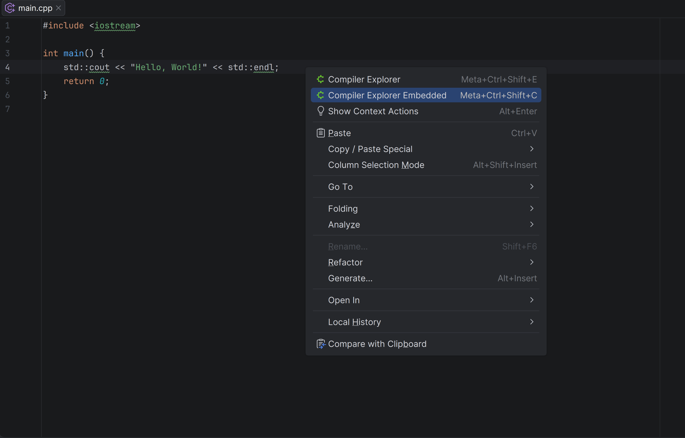
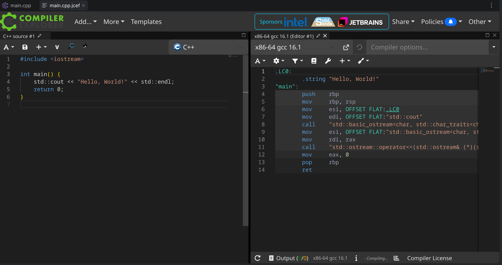
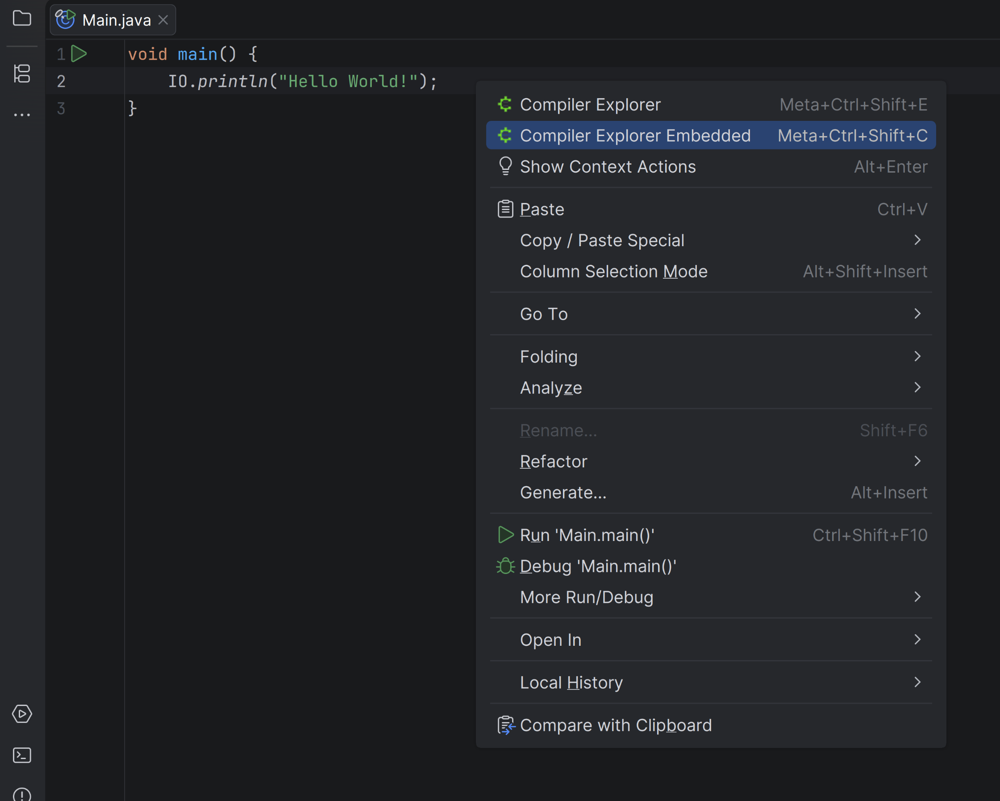
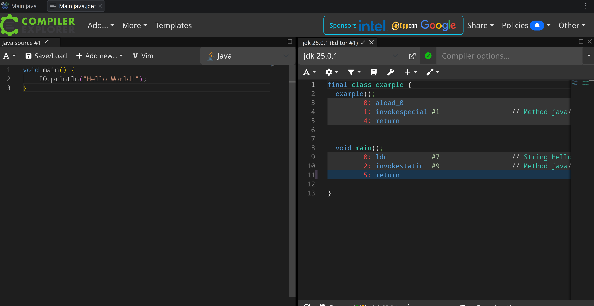

# Compiler Explorer Extension

## Usage

Plugin allow open a file in Compiler Explorer (godbolt.org) from EditorPopupMenu (right-click in editor) or using `ctrl meta shift C` / `ctrl meta shift E` hotkeys

